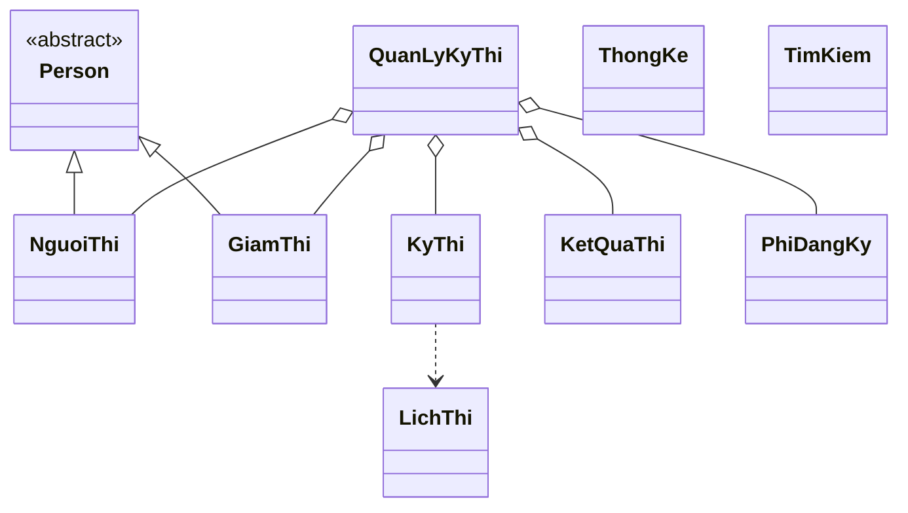

# Mô hình lớp và menu

## Mô hình lớp UML

## Menu chức năng

1. Quản lý người thi: thêm, sửa, xóa, tìm theo mã/tên/CCCD.
2. Quản lý giám thị: thêm, sửa, xóa, phân công kỳ thi.
3. Quản lý kỳ thi và lịch thi: thêm, sửa, xóa, chống trùng lịch, tra cứu theo ngày.
4. Quản lý kết quả: nhập điểm, tự xác định đạt/không đạt, tra cứu.
5. Quản lý phí: cấu hình theo hạng, ghi nhận thanh toán, tra cứu/in biên lai.
6. Thống kê: số người thi, tỷ lệ đậu, doanh thu theo kỳ thi/thời gian/hạng bằng.
0. Thoát.

Chạy menu console bằng lớp `com.mycompany.quanlythilai.QuanLyKyThiApp`.
